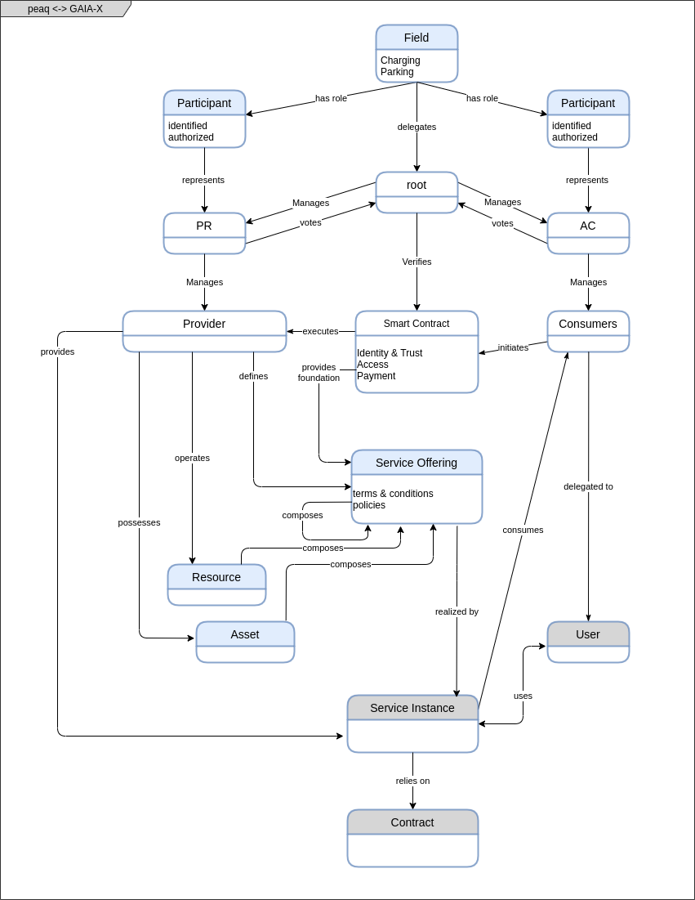

Copyright (c) 2021, Peaq Technology GmbH
# peaq Access GAIA-X technical description

---

peaq tailors distributed ledger technology (DLT) to facilitate participants of GAIA-X decentralized federation, data sharing and service offering establishing trusted relationships through immutable records and decentralized consensus.
  
The peaq network for GAIA-X contains the roles Provider Registrar (PR) and Access Controller (AC) which provide services to Providers (P) and Consumers (C) and Root which provides services that are shared within entire GAIA-X. Root is federated by voting.

# Root

The root entity is a trusted participant who is voted in by GAIA-X and PR entities. Root is a management entity of the system and is empowered to add Provider Registrars (PR) and Access Controllers (AC).

# Federation Services through Smart Contracts

The backbone of peaq’s functions is peaq’s DLT with support for smart contracts which gives it the inherent ability to provide trusted services and allows participants to vote in order to promote any changes.

Due to the distributed nature of DLT, the data is shared between participants in a secure and sovereign manner while still complying with requirements owing to the smart contracts.

# Provider Registrar

This entity represents a service provider offering resources, assets, decentralized identifiers and defined services to smart contracts. These resources and assets require authorization to be accessed and are represented by the “Provider” entity in peaq access.

Upon entering into a contractual agreement with an Access Controller, the Provider Registrar can begin providing access to “Providers” to the Access Controller who can then further associate the Provider with Consumers.

Additionally the Provider Registrar has the ability to “freeze” the contract with the Access Controller thereby preventing them from creating/modifying Provider and Consumer associations while leaving existing associations intact thereby having no impact on the users.

# Access Controller

This entity represents an “operator” of the “Provider” resource or asset and manages “Consumers” who have access to these Providers.

Consumers “consume” an asset or resource and in peaq access. This consumption is managed by associating the Consumer with a “User”.

  

The Access Controller entity also manages an abstract entity called “User” in peaq access control which could represent anything from a human being to a self-driving vehicle. Users can be associated with one or many consumers to unlock theoretically unlimited possibilities.

  

The association between Provider and Consumer allows peaq access to share immutable data within GAIA-X while remaining GDPR compliant.

  

# Providers

Providers are resources or assets that constitute a service offering. In peaq access the Provider Registrar is responsible for defining, authorizing and managing Providers while an Access Controller is responsible for associating them with Consumers. Providers have an immutable data record which is kept on the peaq DLT.

# Consumers

Consumers are entities which can be granted access to certain assets or resources (referred to as Providers) and carry an immutable data record. A Consumer is a logical entity that is then associated with a user thereby granting the user access to the resource.

  

Consumers are authorized by Access Controllers and execute transactions on the peaq DLT for service, data or assets offered by a Provider.